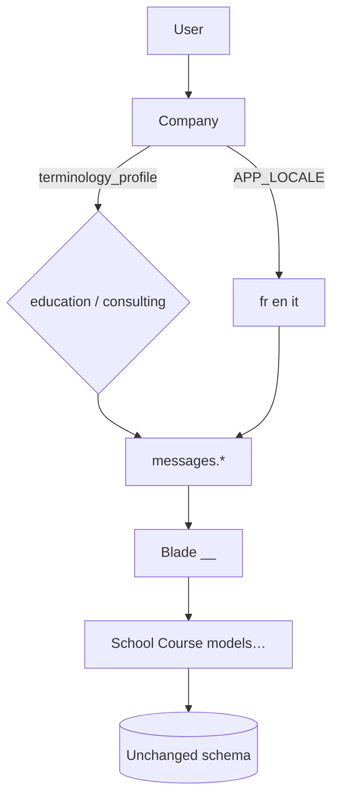

# Phase 1 — company terminology

**FR:** [phase-1-terminologie.md](../fr/phase-1-terminologie.md)

## Summary

Phase 1 switches application **labels** by company profile without changing the schema or routes.

## Components

### Company profile

- Column: `companies.terminology_profile`
- Values: `education` (default) | `consulting`
- Constants: `Company::PROFILE_EDUCATION`, `Company::PROFILE_CONSULTING`
- UI: **My company → Edit** (“Business context” dropdown)

### Locale resolution

Class: `App\Support\TerminologyLocale`

```text
APP_LOCALE (fr | en | it)
        +
terminology_profile (education | consulting)
        ↓
education  → fr, en, it
consulting → fr_consulting, en_consulting, it_consulting
```

### Middleware

- `App\Http\Middleware\SetTerminologyLocale`
- Applied on `auth` route group — `routes/web.php`

### Language files

```text
resources/lang/fr/messages.php
resources/lang/fr_consulting/messages.php   # merge fr + overrides.php
resources/lang/en_consulting/...
resources/lang/it_consulting/...
```

Legacy locale `en_proj`: official replacement is **`en_consulting`**.

### Configuration

- `config/terminology.php`

### Flash messages & PDF

- `messages.*` keys in controllers
- PDF: `messages.invoice_line_group` in `Tools.php`

## Tests & migration

```bash
php artisan migrate
php artisan test --filter=TerminologyLocaleTest
```

Migration: `2026_05_29_120000_add_terminology_profile_to_companies_table`

## Diagram



## Links

- [Configuration](configuration.md)
- [Consulting labels](consulting-labels.md)
