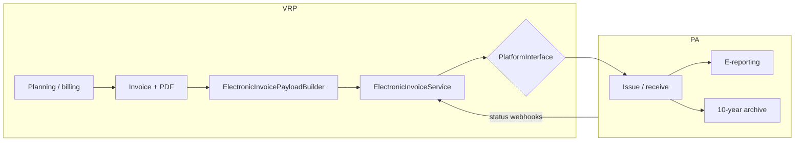

# Roadmap — electronic invoicing

**FR:** [roadmap-facturation-electronique.md](../fr/roadmap-facturation-electronique.md)

> **Current project priority.** The PA (Plateforme agréée) layer is **swappable**: SuperPDP, B2Brouter, or any certified PA plugs in behind the same internal spec.

## Regulatory context

French **B2B e-invoicing** reform requires **structured invoices** (not PDF alone) routed through a **certified Plateforme agréée (PA, formerly PDP)** or, for public sector, **Chorus Pro**.

| Obligation | Date |
|------------|------|
| Receive e-invoices (VAT-registered businesses) | **1 September 2026** |
| Issue — large companies and mid-caps | **1 September 2026** |
| Issue — SMEs, micro-businesses | **1 September 2027** |

VRP today covers **business preparation** and **PDF output** (TCPDF). Compliance relies on a **PA-agnostic abstraction layer** plus an **external PA** for issuance, routing, e-reporting, and legal archiving.

## Current application state

| Item | Status |
|------|--------|
| Invoice PDF (`InvoiceService`, `InvoiceGenerator`) | ✅ |
| Planning ↔ invoice link | ✅ |
| SIREN / SIRET / VAT on `companies` and `schools` | ✅ (fields + UI) |
| E-invoice status on `invoices` | ✅ (`ElectronicInvoiceStatus`) |
| Legal identifiers in PDF (no hard-coded values) | ✅ via company / school records |
| PA-agnostic layer + connectors | ❌ |
| Supplier invoice reception via PA | ❌ |
| Structured submission to PA | ❌ |

Existing `invoices` fields:

- `electronic_invoice_status` — `draft`, `ready`, `transmitted`, `accepted`, `rejected`
- `pdp_reference` — PA-side identifier
- `electronic_status_at` — last status change timestamp
- `rejection_reason` — PA rejection reason

## Target architecture

**Chosen option: A** — VRP prepares; the PA issues and archives.



Principle: **no direct PA dependency** in domain code. Only adapters (`SuperPdpPlatform`, `B2bRouterPlatform`, …) know provider APIs.

## PA-agnostic integration spec

### 1. `ElectronicInvoicePlatform` contract

Single VRP-facing interface:

```php
interface ElectronicInvoicePlatform
{
    public function registerCompany(CompanyRegistration $company): PlatformRegistration;
    public function resolveRecipient(Party $buyer): RecipientRouting;
    public function submitOutbound(ElectronicInvoiceDocument $document): PlatformSubmission;
    public function fetchInbound(?Carbon $since = null): iterable;
    public function parseWebhook(Request $request): PlatformEvent;
    public function verifyWebhook(Request $request): bool;
}
```

Planned drivers:

| Driver | Role |
|--------|------|
| `NullElectronicInvoicePlatform` | Dev / tests — no-op |
| `SuperPdpPlatform` | SuperPDP adapter |
| `B2bRouterPlatform` | B2Brouter adapter |

Selection via `config/electronic-invoicing.php`:

```env
E_INVOICE_PLATFORM=null          # null | superpdp | b2brouter
E_INVOICE_WEBHOOK_SECRET=...
SUPERPDP_CLIENT_ID=...
SUPERPDP_CLIENT_SECRET=...
B2BROUTER_API_KEY=...
```

### 2. Canonical model `ElectronicInvoiceDocument`

Internal VRP DTO aligned with **EN 16931** / Factur-X. The PA may receive this JSON or a Factur-X PDF generated by VRP — the adapter picks the supported format.

```json
{
  "vrp_invoice_id": "XDM26001",
  "issue_date": "2026-06-22",
  "due_date": null,
  "currency": "EUR",
  "type": "invoice",
  "seller": {
    "name": "XDM Consulting",
    "siren": "823059699",
    "siret": "82305969900012",
    "vat_number": "FR12823059699",
    "address": { "line1": "…", "postal_code": "75001", "city": "Paris", "country": "FR" },
    "email": "contact@example.com"
  },
  "buyer": {
    "name": "Example School",
    "siren": "123456789",
    "siret": null,
    "vat_number": null,
    "address": { "line1": "…", "postal_code": "69001", "city": "Lyon", "country": "FR" }
  },
  "lines": [
    {
      "description": "PHP training — Group A",
      "quantity": 21,
      "unit": "HUR",
      "unit_price_ht": 450.00,
      "vat_rate": 20.0,
      "vat_category": "S"
    }
  ],
  "totals": {
    "amount_ht": 9450.00,
    "vat_amount": 1890.00,
    "amount_ttc": 11340.00
  },
  "payment_means": {
    "iban": "FR76…",
    "bic": "AGRIFRPP"
  },
  "pdf_attachment": "<optional base64>"
}
```

**VRP data sources:**

| Canonical field | VRP source |
|-----------------|------------|
| `vrp_invoice_id` | `{bill_prefix}{id}` (`Invoice`) |
| `issue_date` | `bill_date` |
| `seller` | `Company` + `billingDetails()` |
| `buyer` | `School` (B2B client) |
| `lines` | `Tools::getInvoiceDetails()` / PDF lines |
| `totals` | `amountHt()`, `amountTtc()` |
| `pdf_attachment` | `Storage` → `invoices/{prefix}{id}.pdf` |

Planned builder: `ElectronicInvoicePayloadBuilder::fromInvoice(Invoice $invoice)`.

### 3. Lifecycle and status mapping

VRP statuses (`ElectronicInvoiceStatus`):

| VRP status | Meaning | Trigger |
|------------|---------|---------|
| `draft` | Draft, not submittable | Partial creation (future) |
| `ready` | Ready — PDF OK, legal data complete | `InvoiceController::store` |
| `transmitted` | Accepted by PA | Webhook / submit API response |
| `accepted` | Validated by recipient / lifecycle OK | PA webhook |
| `rejected` | Rejected (validation or recipient) | PA webhook + `rejection_reason` |

Normalized PA events (`PlatformEvent`):

| `PlatformEventType` | VRP action |
|---------------------|------------|
| `outbound.submitted` | `ready` → `transmitted`, set `pdp_reference` |
| `outbound.accepted` | → `accepted` |
| `outbound.rejected` | → `rejected`, set `rejection_reason` |
| `inbound.received` | Create supplier invoice draft (phase 2) |

Each adapter maps PA codes to these types — never the domain controller.

### 4. Webhooks

Dedicated route (no user session):

```
POST /webhooks/e-invoice/{platform}
```

Flow:

1. `verifyWebhook()` — HMAC signature or token per PA
2. `parseWebhook()` → `PlatformEvent`
3. `ElectronicInvoiceService::applyEvent(PlatformEvent)`
4. Update `Invoice` + optional log (`electronic_invoice_events` — future table)

Return HTTP **200** quickly; heavy work in queue (`ProcessPlatformEvent` job).

### 5. Pre-submission validation

`ElectronicInvoiceValidator` blocks `ready` → submit when:

| Rule | Field |
|------|-------|
| Issuer: 9-digit SIREN | `companies.siren` |
| Issuer: full address | `companies.address`, `city`, `zip` |
| B2B client: SIREN or SIRET | `schools.siren` / `siret` |
| Client: address | `schools.address`, `city`, `zip` |
| Invoice: unique number | `invoices.id` + `bill_prefix` |
| Invoice: at least one HT line > 0 | planning or flat lines |
| Invoice: not paid / not locked | `paid_at` null |

User message: missing fields with links to **My company** or school record.

### 6. Planned code structure

```
app/
  Contracts/ElectronicInvoicePlatform.php
  DTO/ElectronicInvoice/
    ElectronicInvoiceDocument.php
    Party.php
    InvoiceLine.php
    PlatformEvent.php
    PlatformSubmission.php
  Enums/
    ElectronicInvoiceStatus.php          # existing
    PlatformEventType.php
  Services/ElectronicInvoicing/
    ElectronicInvoiceService.php
    ElectronicInvoicePayloadBuilder.php
    ElectronicInvoiceValidator.php
  Platforms/
    NullElectronicInvoicePlatform.php
    SuperPdpPlatform.php
    B2bRouterPlatform.php
  Http/Controllers/ElectronicInvoiceWebhookController.php
  Jobs/ProcessPlatformEvent.php
config/electronic-invoicing.php
routes/web.php
```

### 7. User UI (phases)

| Phase | Screen | Action |
|-------|--------|--------|
| 1 | Invoice list | E-invoice status column (existing) |
| 2 | Detail / list | **Issue e-invoice** button if `ready` |
| 2 | Detail | Show `pdp_reference`, rejection reason |
| 2 | Treasury | **Received invoices** tab (PA inbound) |
| 3 | My company | PA onboarding state (connected / incomplete) |

**Paid** tracking (`paid_at`) stays independent of e-invoice status.

## VRP development phases

### Phase 1 — Foundations ✅ *done*

- Legal identifiers on `companies` / `schools`
- E-invoice statuses on `invoices`
- PDF fed from company / client records

### Phase 2 — PA layer + reception (target: Sep 2026)

1. `ElectronicInvoicePlatform` contract + `Null` driver
2. `ElectronicInvoicePayloadBuilder` + validator
3. Webhook + `ElectronicInvoiceService`
4. First PA adapter (sandbox) — **PA choice at implementation time**
5. Supplier invoice reception (minimal UI)
6. Tests: payload builder, status mapping, webhook

### Phase 3 — Issuance (target: Sep 2027 for SMEs)

1. **Issue e-invoice** button from VRP
2. Company onboarding with PA (directory)
3. Outbound submit + lifecycle tracking
4. Credit notes (`type: credit_note`)

### Phase 4 — Quality

- Tests: 20% VAT, planning lines, flat fee
- Sequential numbering (PA coordination)
- Webhook monitoring / retry

## PA candidates (non-exclusive)

Choice **deferred until wiring the adapter** — the spec above does not change.

| PA | VRP fit | Watch points |
|----|---------|--------------|
| [SuperPDP](https://www.superpdp.tech/) | API-first, low per-invoice cost, French PA | Grey-label editor model by default |
| [B2Brouter](https://www.b2brouter.net/fr/api-facturation-electronique/) | White-label editor, DGFiP docs, sandbox | Editor pricing on quote |

Selection criteria: multi-tenant cost, white-label UX, sandbox quality, webhooks, Chorus / public sector if relevant.

## Out of VRP scope (delegated to PA)

- Direct PPF / DGFiP SFTP connection
- 10-year legal archiving (held by PA)
- B2C / POS e-reporting (unless extended later)
- Qualified electronic signature

## Client cases

| Client type (`school`) | Channel |
|------------------------|---------|
| Private B2B with SIREN | PA → directory |
| Public sector | Chorus Pro (via connected PA) |
| Individual / no SIREN | Outside B2B structured obligation — VRP PDF only |

## Immediate actions

1. Complete **SIREN / SIRET** on existing records (user data).
2. Run **one pilot invoice** in PA sandbox (SuperPDP or B2Brouter).
3. Implement **Phase 2**: contract + builder + webhook + null driver.
4. Pick the PA when coding the **first real adapter**.

## Existing code

- `app/Enums/ElectronicInvoiceStatus.php`
- `app/Models/Invoice.php`
- `app/Services/InvoiceService.php`
- `app/Classes/InvoiceGenerator.php`

## Links

- [README — roadmap summary](../../README.md#roadmap--facturation-électronique)
- [PWA & offline roadmap](roadmap-pwa-offline.md) — deferred, not priority
