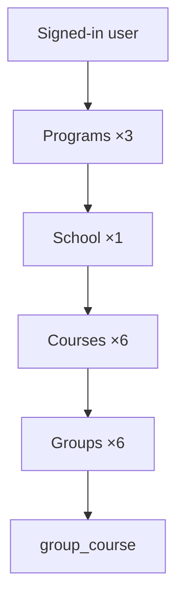

# Creation workflow (school, programs, courses, groups)

**FR:** [parcours-creation-ecole.md](../fr/parcours-creation-ecole.md)

## Recommended order

Create **programs** first (company-wide), then the **school**, then **courses** (each references a program), then **groups** linked to each course.

```text
1. Programs (×3)     →  /program
2. School (×1)       →  /school
3. Courses (×6)      →  /course/{school_id}/create
4. Groups (×6)       →  /group/{course_id}/create  (+ group_course pivot)
```

## Target example

**1 school**, **3 programs**, **2 courses per program**, **one distinct group per course** → **6 groups** total.

```text
School "My institution"
├── Program A
│   ├── Course A-1 → Group G-A1
│   └── Course A-2 → Group G-A2
├── Program B
│   ├── Course B-1 → Group G-B1
│   └── Course B-2 → Group G-B2
└── Program C
    ├── Course C-1 → Group G-C1
    └── Course C-2 → Group G-C2
```

## Routes (excerpt)

| Step | Named route | Controller |
|------|-------------|------------|
| Program | `program.store` | `ProgramController@store` |
| School | `school.store` | `SchoolController@store` |
| Course | `course.store` | `CourseController@store` |
| Group | `group.save` | `GroupController@store` |

## “Distinct groups” rule

For **one group per course**, create **6 different groups** (do not reuse the same `group_id` on multiple courses unless linking explicitly via `group.link`).

## User journey diagram



## Links

- [Data model](training-data-model.md)
- [Phase 1 — terminology](phase-1-terminology.md)
