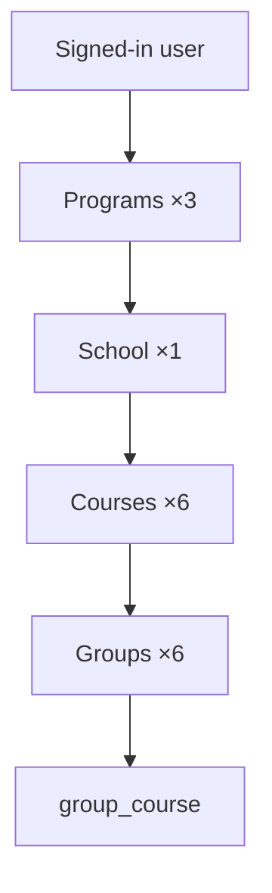

# Creation workflow (school, programs, courses, groups)

**FR:** [parcours-creation-ecole.md](../fr/parcours-creation-ecole.md)

## Recommended order

Create **programs** first (company-wide), then the **school**, then **courses** (each references a program), then **groups** linked to each course.

```text
1. Programs (×3)     →  /program
2. School (×1)       →  /school
3. Courses (×6)      →  /course/{school_id}/create
4. Groups (×6)       →  /group/{course_id}/create  (+ group_course pivot)
```

## Target example

**1 school**, **3 programs**, **2 courses per program**, **one distinct group per course** → **6 groups** total.

```text
School "My institution"
├── Program A
│   ├── Course A-1 → Group G-A1
│   └── Course A-2 → Group G-A2
├── Program B
│   ├── Course B-1 → Group G-B1
│   └── Course B-2 → Group G-B2
└── Program C
    ├── Course C-1 → Group G-C1
    └── Course C-2 → Group G-C2
```

## Routes (excerpt)

| Step | Named route | Controller |
|------|-------------|------------|
| Program | `program.store` | `ProgramController@store` |
| School | `school.store` | `SchoolController@store` |
| Course | `course.store` | `CourseController@store` |
| Group | `group.save` | `GroupController@store` |

The course form (`create` / `edit`) is a compact two-row layout:

| Row | Component | Fields |
|-----|-----------|--------|
| Identity | `course-identity-fields` | Short name, program, year, semester |
| Volume + rate | `course-volume-fields` | **n sessions of n hours** (live total) and hourly rate |

Create defaults: calendar year = now; semester = `1` (Jan–Jun) or `2` (Jul–Dec) via `Tools::defaultCourseSemester()`.

### Hourly rate (TTC in the form, HT in the database)

The radio defaults to **TTC**. `CourseController` stores `courses.rate` as HT (`Tools::hourlyRateHt()`, VAT multiplier **1.2**). Edit reloads the field as TTC (`Tools::hourlyRateTtc($course->rate)`). Unknown `rate_basis` is treated as TTC. Commas in decimals are normalized to dots before validation.

HT is stored with **4 decimal places** so TTC round-trips: `33.33` TTC → `27.775` HT → edit shows `33.33` again. Display TTC is 2 decimals.

| Constraint | Detail |
|------------|--------|
| Validation | `sessions`, `session_length`, `rate` required numeric ≥ 0; `rate_basis` optional `ht`/`ttc` |
| After create | Redirects to `dashboard` (`/home`), with `course` / `course_id` set in session |
| After update | Redirects to `school.show` (the school course list), not `/home` |

## School documents

On `school.show?panel=documents` (Edit mode):

| Constraint | Detail |
|------------|--------|
| Route | `POST /school/{school_id}/document` (`document.store`) |
| Fields | `description` required; `year`; file `document` |
| File types | PDF, DOC, DOCX — max **4096 KB** (`DocumentController@store`) |
| Storage | `storage/app/public/data_store/{timestamp}_{originalName}` — needs `php artisan storage:link` |
| List / delete | `documents-school-table`; delete via Alpine `documentDelete` → `documents.destroy` |

`DocumentController::edit` is empty; the edit button on the table currently has no implementation.

## “Distinct groups” rule

For **one group per course**, create **6 different groups** (do not reuse the same `group_id` on multiple courses unless linking explicitly via `group.link`).

## User journey diagram


```mermaid
flowchart TD
    U[Signed-in user] --> P[Programs ×3]
    P --> S[School ×1]
    S --> C[Courses ×6]
    C --> G[Groups ×6]
    G --> GC[group_course]
```

## Links

- [Data model](training-data-model.md)
- [Phase 1 — terminology](phase-1-terminology.md)
- [V2 — school mode mentoring](v2-school-mode-mentoring.md) — `?panel=` tabs
- [Calendar import](calendar-import.md)
