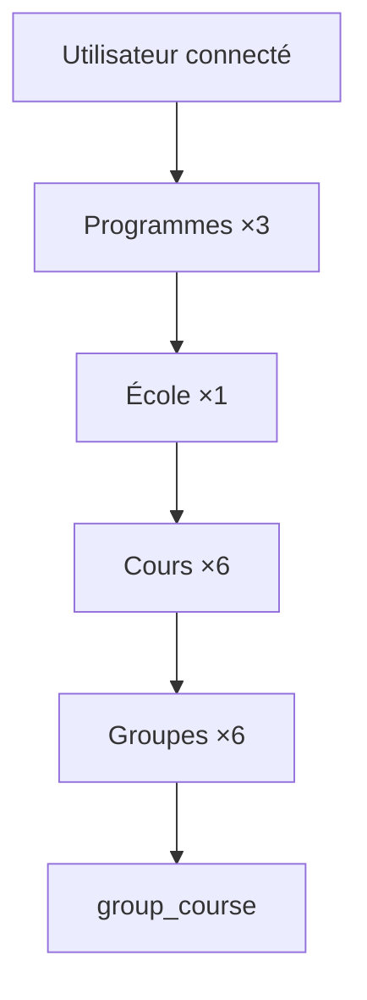

# Parcours de création (école, programmes, cours, groupes)

**EN:** [school-creation-workflow.md](../en/school-creation-workflow.md)

## Ordre recommandé

Les **programmes** sont créés en premier (globaux à l’entreprise), puis l’**école**, puis les **cours** (chaque cours référence un programme), enfin les **groupes** liés à chaque cours.

```text
1. Programmes (×3)     →  /program
2. École (×1)          →  /school
3. Cours (×6)          →  /course/{school_id}/create
4. Groupes (×6)        →  /group/{course_id}/create  (+ pivot group_course)
```

## Exemple cible

**1 école**, **3 programmes**, **2 cours par programme**, **1 groupe distinct par cours** → **6 groupes** au total.

```text
École « Mon établissement »
├── Programme A
│   ├── Cours A-1 → Groupe G-A1
│   └── Cours A-2 → Groupe G-A2
├── Programme B
│   ├── Cours B-1 → Groupe G-B1
│   └── Cours B-2 → Groupe G-B2
└── Programme C
    ├── Cours C-1 → Groupe G-C1
    └── Cours C-2 → Groupe G-C2
```

## Routes (extrait)

| Étape | Route nommée | Contrôleur |
|-------|----------------|------------|
| Programme | `program.store` | `ProgramController@store` |
| École | `school.store` | `SchoolController@store` |
| Cours | `course.store` | `CourseController@store` |
| Groupe | `group.save` | `GroupController@store` |

## Règle « groupes distincts »

Pour un groupe **par cours**, créer **6 groupes différents** (ne pas réutiliser le même `group_id` sur plusieurs cours sauf lien explicite via `group.link`).

## Diagramme (parcours utilisateur)



## Liens

- [Modèle de données](modele-donnees-formation.md)
- [Phase 1 — terminologie](phase-1-terminologie.md)
