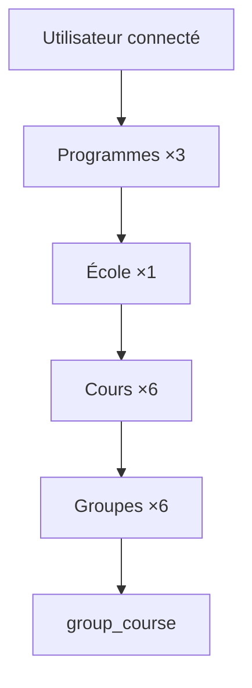

# Parcours de création (école, programmes, cours, groupes)

**EN:** [school-creation-workflow.md](../en/school-creation-workflow.md)

## Ordre recommandé

Les **programmes** sont créés en premier (globaux à l’entreprise), puis l’**école**, puis les **cours** (chaque cours référence un programme), enfin les **groupes** liés à chaque cours.

```text
1. Programmes (×3)     →  /program
2. École (×1)          →  /school
3. Cours (×6)          →  /course/{school_id}/create
4. Groupes (×6)        →  /group/{course_id}/create  (+ pivot group_course)
```

## Exemple cible

**1 école**, **3 programmes**, **2 cours par programme**, **1 groupe distinct par cours** → **6 groupes** au total.

```text
École « Mon établissement »
├── Programme A
│   ├── Cours A-1 → Groupe G-A1
│   └── Cours A-2 → Groupe G-A2
├── Programme B
│   ├── Cours B-1 → Groupe G-B1
│   └── Cours B-2 → Groupe G-B2
└── Programme C
    ├── Cours C-1 → Groupe G-C1
    └── Cours C-2 → Groupe G-C2
```

## Routes (extrait)

| Étape | Route nommée | Contrôleur |
|-------|----------------|------------|
| Programme | `program.store` | `ProgramController@store` |
| École | `school.store` | `SchoolController@store` |
| Cours | `course.store` | `CourseController@store` |
| Groupe | `group.save` | `GroupController@store` |

Le formulaire cours (`create` / `edit`) est un layout compact sur deux lignes :

| Ligne | Composant | Champs |
|-------|-----------|--------|
| Identité | `course-identity-fields` | Sigle, programme, année, semestre |
| Volume + tarif | `course-volume-fields` | **n sessions de n heures** (total live) et taux horaire |

Défauts à la création : année = maintenant ; semestre = `1` (jan–juin) ou `2` (juil–déc) via `Tools::defaultCourseSemester()`.

### Taux horaire (TTC à l’écran, HT en base)

Le radio est **TTC** par défaut. `CourseController` stocke `courses.rate` en HT (`Tools::hourlyRateHt()`, multiplicateur TVA **1,2**). L’édition recharge le champ en TTC (`Tools::hourlyRateTtc($course->rate)`). Un `rate_basis` inconnu est traité comme TTC. Les virgules décimales sont normalisées en points avant validation.

Le HT est stocké sur **4 décimales** pour un aller-retour TTC : `33,33` TTC → `27,775` HT → l’édition réaffiche `33,33`. L’affichage TTC reste à 2 décimales.

| Contrainte | Détail |
|------------|--------|
| Validation | `sessions`, `session_length`, `rate` numériques ≥ 0 ; `rate_basis` optionnel `ht`/`ttc` |
| Après création | Redirection vers `dashboard` (`/home`), `course` / `course_id` en session |
| Après modification | Redirection vers `school.show` (liste des cours de l’école), pas `/home` |

## Documents de l’école

Sur `school.show?panel=documents` (mode Édition) :

| Contrainte | Détail |
|------------|--------|
| Route | `POST /school/{school_id}/document` (`document.store`) |
| Champs | `description` obligatoire ; `year` ; fichier `document` |
| Types | PDF, DOC, DOCX — max **4096 Ko** (`DocumentController@store`) |
| Stockage | `storage/app/public/data_store/{timestamp}_{nomOriginal}` — nécessite `php artisan storage:link` |
| Liste / suppression | `documents-school-table` ; suppression Alpine `documentDelete` → `documents.destroy` |

`DocumentController::edit` est vide ; le bouton modifier du tableau n’a pas d’implémentation.

## Règle « groupes distincts »

Pour un groupe **par cours**, créer **6 groupes différents** (ne pas réutiliser le même `group_id` sur plusieurs cours sauf lien explicite via `group.link`).

## Diagramme (parcours utilisateur)


```mermaid
flowchart TD
    U[Utilisateur connecté] --> P[Programmes ×3]
    P --> S[École ×1]
    S --> C[Cours ×6]
    C --> G[Groupes ×6]
    G --> GC[group_course]
```

## Liens

- [Modèle de données](modele-donnees-formation.md)
- [Phase 1 — terminologie](phase-1-terminologie.md)
- [V2 — mode école mentoring](v2-mode-ecole-mentoring.md) — onglets `?panel=`
- [Import calendrier](import-calendrier.md)
