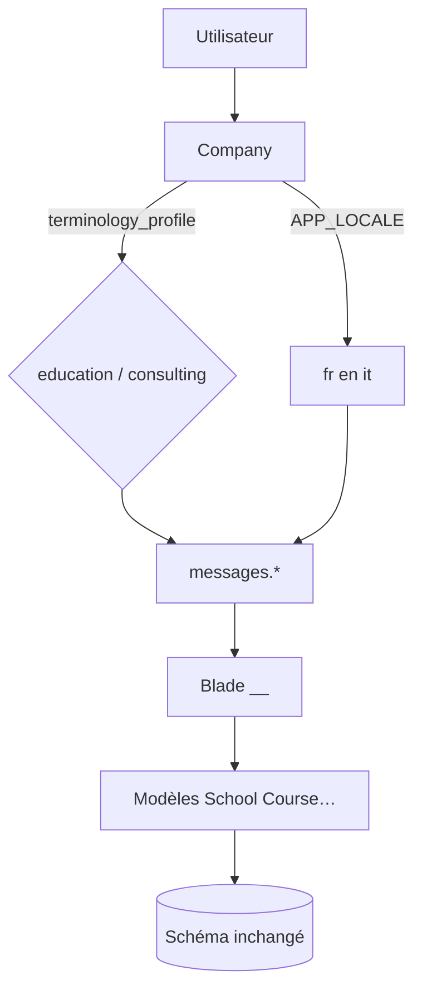

# Phase 1 — terminologie par entreprise

**EN:** [phase-1-terminology.md](../en/phase-1-terminology.md)

## Résumé

La phase 1 permet de basculer les **libellés** de l’application selon le profil de l’entreprise, sans modifier le schéma ni les routes.

## Composants

### Profil entreprise

- Colonne : `companies.terminology_profile`
- Valeurs : `education` (défaut) | `consulting`
- Constantes : `Company::PROFILE_EDUCATION`, `Company::PROFILE_CONSULTING`
- UI : **Mon entreprise → Modifier** (liste « Contexte métier »)

### Résolution de locale

Classe : `App\Support\TerminologyLocale`

```text
APP_LOCALE (fr | en | it)
        +
terminology_profile (education | consulting)
        ↓
education  → fr, en, it
consulting → fr_consulting, en_consulting, it_consulting
```

### Middleware

- `App\Http\Middleware\SetTerminologyLocale`
- Groupe de routes `auth` — `routes/web.php`

### Fichiers de langue

```text
resources/lang/fr/messages.php
resources/lang/fr_consulting/messages.php   # merge fr + overrides.php
resources/lang/en_consulting/...
resources/lang/it_consulting/...
```

Locale historique `en_proj` : variante officielle **`en_consulting`**.

### Configuration

- `config/terminology.php`

### Messages flash & PDF

- Clés `messages.*` dans les contrôleurs
- PDF : `messages.invoice_line_group` dans `Tools.php`

## Tests & migration

```bash
php artisan migrate
php artisan test --filter=TerminologyLocaleTest
```

Migration : `2026_05_29_120000_add_terminology_profile_to_companies_table`

## Diagramme



## Liens

- [Configuration](configuration.md)
- [Libellés consulting](libelles-consulting.md)
