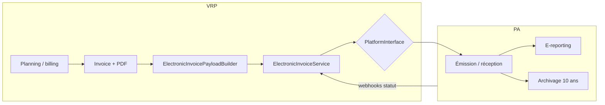

# Roadmap — facturation électronique

**EN:** [roadmap-electronic-invoicing.md](../en/roadmap-electronic-invoicing.md)

> **Priorité actuelle du projet.** La couche PA (Plateforme agréée) est ** interchangeable** : SuperPDP, B2Brouter ou autre PA certifiée se branchent derrière la même spec interne.

## Contexte réglementaire

La réforme de la **facturation électronique B2B** en France impose des factures **structurées** (pas seulement un PDF) et leur circulation via une **Plateforme agréée (PA, ex-PDP)** ou, pour le secteur public, **Chorus Pro**.

| Obligation | Date |
|------------|------|
| Réception des factures électroniques (assujettis TVA) | **1ᵉʳ septembre 2026** |
| Émission — GE et ETI | **1ᵉʳ septembre 2026** |
| Émission — PME, TPE, micro-entreprises | **1ᵉʳ septembre 2027** |

VRP couvre aujourd’hui la **préparation métier** et l’**émission PDF** (TCPDF). La conformité au nouveau modèle repose sur une **couche d’abstraction PA** + une **PA externe** pour émission, routage, e-reporting et archivage probant.

## État actuel dans l’application

| Élément | Statut |
|---------|--------|
| PDF facture (`InvoiceService`, `InvoiceGenerator`) | ✅ |
| Lien planning ↔ facture | ✅ |
| SIREN / SIRET / TVA sur `companies` et `schools` | ✅ (champs + écrans) |
| Statuts e-facture sur `invoices` | ✅ (`ElectronicInvoiceStatus`) |
| Identifiants légaux dans le PDF (plus de valeurs en dur) | ✅ via fiches société / école |
| Couche PA agnostique + connecteurs | ❌ |
| Réception fournisseurs via PA | ❌ |
| Émission structurée vers PA | ❌ |

Champs existants sur `invoices` :

- `electronic_invoice_status` — `draft`, `ready`, `transmitted`, `accepted`, `rejected`
- `pdp_reference` — identifiant côté PA
- `electronic_status_at` — horodatage du dernier changement
- `rejection_reason` — motif de rejet PA

## Architecture cible

**Option retenue : A** — VRP prépare ; la PA émet et archive.



Principe : **aucune dépendance directe** de VRP à une PA dans le métier. Seuls les adaptateurs (`SuperPdpPlatform`, `B2bRouterPlatform`, …) connaissent l’API du fournisseur.

## Spec d’intégration PA-agnostique

### 1. Contrat `ElectronicInvoicePlatform`

Interface unique côté VRP :

```php
interface ElectronicInvoicePlatform
{
    /** Enregistre l’entreprise émettrice auprès de la PA (onboarding KYC / annuaire). */
    public function registerCompany(CompanyRegistration $company): PlatformRegistration;

    /** Résout l’adresse de facturation électronique du destinataire (annuaire). */
    public function resolveRecipient(Party $buyer): RecipientRouting;

    /** Émet une facture sortante. Retourne la référence PA. */
    public function submitOutbound(ElectronicInvoiceDocument $document): PlatformSubmission;

    /** Liste ou récupère les factures entrantes (réception fournisseur). */
    public function fetchInbound(?Carbon $since = null): iterable;

    /** Interprète un webhook brut en événement normalisé. */
    public function parseWebhook(Request $request): PlatformEvent;

    /** Vérifie la signature / authenticité du webhook. */
    public function verifyWebhook(Request $request): bool;
}
```

Implémentations prévues :

| Driver | Rôle |
|--------|------|
| `NullElectronicInvoicePlatform` | Dev / tests — no-op |
| `SuperPdpPlatform` | Adaptateur SuperPDP |
| `B2bRouterPlatform` | Adaptateur B2Brouter |

Sélection via `config/electronic-invoicing.php` :

```env
E_INVOICE_PLATFORM=null          # null | superpdp | b2brouter
E_INVOICE_WEBHOOK_SECRET=...
SUPERPDP_CLIENT_ID=...
SUPERPDP_CLIENT_SECRET=...
B2BROUTER_API_KEY=...
```

### 2. Modèle canonique `ElectronicInvoiceDocument`

DTO interne VRP, aligné **EN 16931** / Factur-X. La PA peut recevoir ce JSON ou un PDF Factur-X généré par VRP — l’adaptateur choisit le format supporté.

```json
{
  "vrp_invoice_id": "XDM26001",
  "issue_date": "2026-06-22",
  "due_date": null,
  "currency": "EUR",
  "type": "invoice",
  "seller": {
    "name": "XDM Consulting",
    "siren": "823059699",
    "siret": "82305969900012",
    "vat_number": "FR12823059699",
    "address": { "line1": "…", "postal_code": "75001", "city": "Paris", "country": "FR" },
    "email": "contact@example.com"
  },
  "buyer": {
    "name": "École Example",
    "siren": "123456789",
    "siret": null,
    "vat_number": null,
    "address": { "line1": "…", "postal_code": "69001", "city": "Lyon", "country": "FR" }
  },
  "lines": [
    {
      "description": "Formation PHP — Groupe A",
      "quantity": 21,
      "unit": "HUR",
      "unit_price_ht": 450.00,
      "vat_rate": 20.0,
      "vat_category": "S"
    }
  ],
  "totals": {
    "amount_ht": 9450.00,
    "vat_amount": 1890.00,
    "amount_ttc": 11340.00
  },
  "payment_means": {
    "iban": "FR76…",
    "bic": "AGRIFRPP"
  },
  "pdf_attachment": "<base64 optionnel>"
}
```

**Source des données VRP :**

| Champ canonique | Source VRP |
|-----------------|------------|
| `vrp_invoice_id` | `{bill_prefix}{id}` (`Invoice`) |
| `issue_date` | `bill_date` |
| `seller` | `Company` + `billingDetails()` |
| `buyer` | `School` (client B2B) |
| `lines` | `Tools::getInvoiceDetails()` / lignes PDF |
| `totals` | `amountHt()`, `amountTtc()` |
| `pdf_attachment` | `Storage` → `invoices/{prefix}{id}.pdf` |

Builder prévu : `ElectronicInvoicePayloadBuilder::fromInvoice(Invoice $invoice)`.

### 3. Cycle de vie et mapping des statuts

Statuts VRP (`ElectronicInvoiceStatus`) :

| Statut VRP | Signification | Déclencheur |
|------------|---------------|-------------|
| `draft` | Brouillon, non transmissible | Création partielle (futur) |
| `ready` | Prête — PDF OK, données légales complètes | `InvoiceController::store` |
| `transmitted` | Dépôt accepté par la PA | Webhook / réponse API submit |
| `accepted` | Validée par le destinataire / cycle de vie OK | Webhook PA |
| `rejected` | Rejetée (validation ou destinataire) | Webhook PA + `rejection_reason` |

Événements PA normalisés (`PlatformEvent`) :

| `PlatformEventType` | Action VRP |
|---------------------|------------|
| `outbound.submitted` | `ready` → `transmitted`, remplir `pdp_reference` |
| `outbound.accepted` | → `accepted` |
| `outbound.rejected` | → `rejected`, remplir `rejection_reason` |
| `inbound.received` | Créer brouillon facture fournisseur (phase 2) |

Chaque adaptateur mappe les codes PA vers ces types — jamais le contrôleur métier.

### 4. Webhooks

Route dédiée (sans session utilisateur) :

```
POST /webhooks/e-invoice/{platform}
```

Flux :

1. `verifyWebhook()` — signature HMAC ou token selon PA
2. `parseWebhook()` → `PlatformEvent`
3. `ElectronicInvoiceService::applyEvent(PlatformEvent)`
4. Mise à jour `Invoice` + journal (`electronic_invoice_events` — table future optionnelle)

Réponse HTTP **200** rapidement ; traitement lourd en queue (`ProcessPlatformEvent` job).

### 5. Validations avant émission

`ElectronicInvoiceValidator` bloque le passage `ready` → submit si :

| Règle | Champ |
|-------|-------|
| Émetteur : SIREN 9 chiffres | `companies.siren` |
| Émetteur : adresse complète | `companies.address`, `city`, `zip` |
| Client B2B : SIREN ou SIRET | `schools.siren` / `siret` |
| Client : adresse | `schools.address`, `city`, `zip` |
| Facture : numéro unique | `invoices.id` + `bill_prefix` |
| Facture : au moins une ligne HT > 0 | lignes planning ou forfait |
| Facture : non payée / non verrouillée | `paid_at` null |

Message utilisateur : liste des champs manquants avec lien vers **Mon entreprise** ou fiche école.

### 6. Structure de code prévue

```
app/
  Contracts/ElectronicInvoicePlatform.php
  DTO/ElectronicInvoice/
    ElectronicInvoiceDocument.php
    Party.php
    InvoiceLine.php
    PlatformEvent.php
    PlatformSubmission.php
  Enums/
    ElectronicInvoiceStatus.php          # existant
    PlatformEventType.php
  Services/ElectronicInvoicing/
    ElectronicInvoiceService.php         # orchestration
    ElectronicInvoicePayloadBuilder.php
    ElectronicInvoiceValidator.php
  Platforms/
    NullElectronicInvoicePlatform.php
    SuperPdpPlatform.php
    B2bRouterPlatform.php
  Http/Controllers/ElectronicInvoiceWebhookController.php
  Jobs/ProcessPlatformEvent.php
config/electronic-invoicing.php
routes/web.php                           # webhook
```

### 7. UI utilisateur (phases)

| Phase | Écran | Action |
|-------|-------|--------|
| 1 | Liste factures | Colonne statut e-facture (existant) |
| 2 | Détail / liste | Bouton **Émettre e-facture** si `ready` |
| 2 | Détail | Afficher `pdp_reference`, motif rejet |
| 2 | Trésorerie | Onglet **Factures reçues** (inbound PA) |
| 3 | Mon entreprise | État onboarding PA (connecté / incomplet) |

Le suivi **payée** (`paid_at`) reste indépendant du statut e-facture.

## Phases de développement VRP

### Phase 1 — Fondations ✅ *en place*

- Identifiants légaux `companies` / `schools`
- Statuts e-facture sur `invoices`
- PDF alimenté par les fiches société / client

### Phase 2 — Couche PA + réception (cible : sept. 2026)

1. Contrat `ElectronicInvoicePlatform` + driver `Null`
2. `ElectronicInvoicePayloadBuilder` + validateur
3. Webhook + `ElectronicInvoiceService`
4. Premier adaptateur PA (sandbox) — **choix PA au moment de l’implémentation**
5. Réception factures fournisseurs (affichage minimal)
6. Tests : payload builder, mapping statuts, webhook

### Phase 3 — Émission (cible : sept. 2027 PME)

1. Bouton **Émettre e-facture** depuis VRP
2. Onboarding entreprise par PA (annuaire)
3. Envoi outbound + suivi cycle de vie
4. Avoirs / rectificatives (extension `type: credit_note`)

### Phase 4 — Qualité

- Tests TVA 20 %, lignes planning, forfait
- Numérotation chronologique (coordination PA)
- Monitoring webhooks / retry

## PA candidates (non exclusives)

Choix **reporté au branchement de l’adaptateur** — la spec ci-dessus ne change pas.

| PA | Atouts pour VRP | Points de vigilance |
|----|-----------------|---------------------|
| [SuperPDP](https://www.superpdp.tech/) | API-first, tarif bas à la facture, PA française | Marque grise éditeur par défaut |
| [B2Brouter](https://www.b2brouter.net/fr/api-facturation-electronique/) | Marque blanche éditeur, doc DGFiP, sandbox | Tarif éditeur sur devis |

Critères de sélection : coût multi-tenant, UX marque blanche, qualité sandbox, webhooks, support Chorus / secteur public si clients écoles publiques.

## Hors périmètre VRP (délégué à la PA)

- Connexion directe PPF / SFTP DGFiP
- Archivage probant 10 ans (conservation chez la PA)
- E-reporting B2C / caisse (sauf extension future)
- Signature électronique qualifiée

## Cas clients

| Type client (`school`) | Canal |
|------------------------|-------|
| B2B privé avec SIREN | PA → annuaire |
| Secteur public | Chorus Pro (via PA connectée) |
| Particulier / sans SIREN | Hors obligation structurée B2B — PDF VRP seul |

## Actions immédiates

1. Finaliser les **SIREN / SIRET** sur les fiches existantes (données utilisateur).
2. Tester **une facture pilote** en sandbox PA (SuperPDP ou B2Brouter).
3. Implémenter **Phase 2** : contrat + builder + webhook + driver null.
4. Choisir la PA au moment de coder le **premier adaptateur réel**.

## Code existant

- `app/Enums/ElectronicInvoiceStatus.php`
- `app/Models/Invoice.php`
- `app/Services/InvoiceService.php`
- `app/Classes/InvoiceGenerator.php`

## Liens

- [README — résumé roadmap](../../README.md#roadmap--facturation-électronique)
- [Roadmap PWA & offline](roadmap-pwa-offline.md) — reportée, non prioritaire
